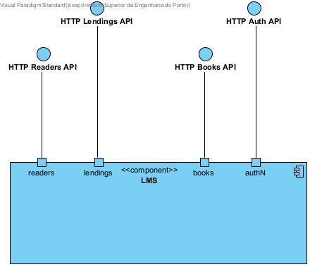
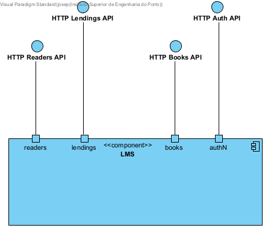
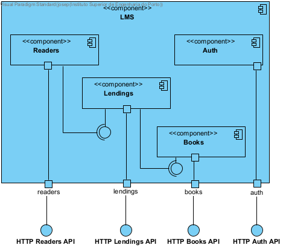
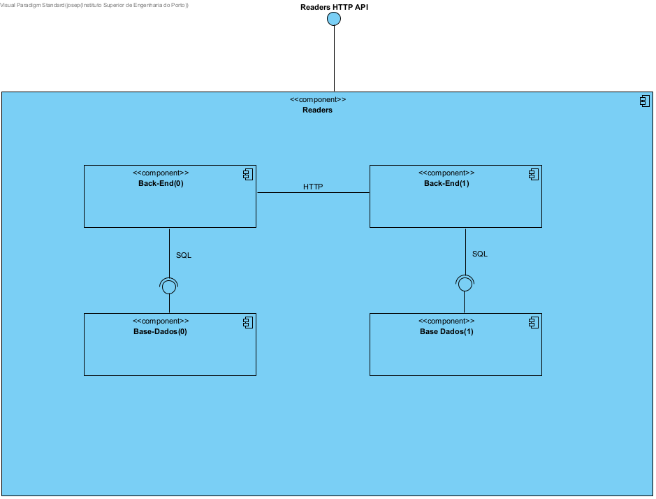

# Vista Lógica
## 1. Requirements Engineering

### 1.1. Description

- explicar as vistas

- explicar as vistas

- explicar as vistas

- explicar as vistas

- explicar as vistas

### 1.2 Functionality

- n/a

### 1.3 Other Relevant Remarks

- n/a

## 2. Observations

- n/a
